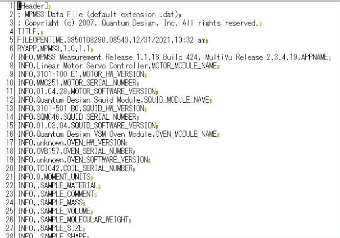
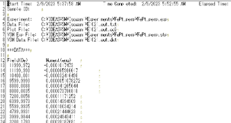
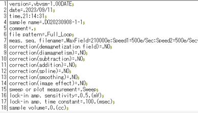
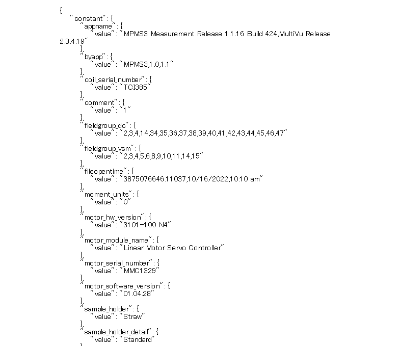
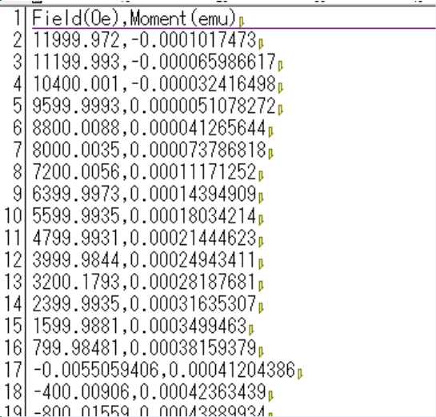
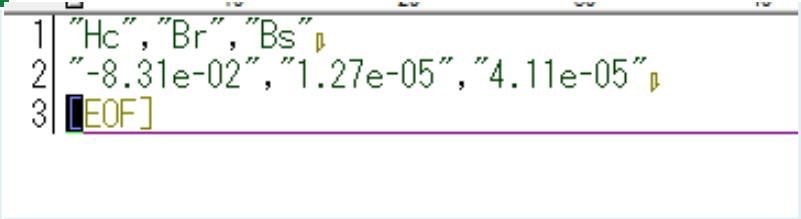
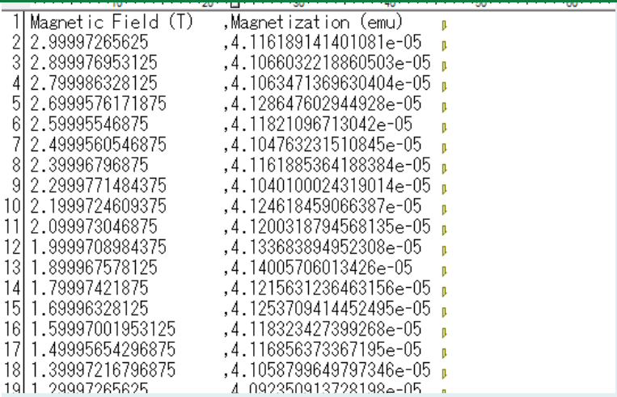
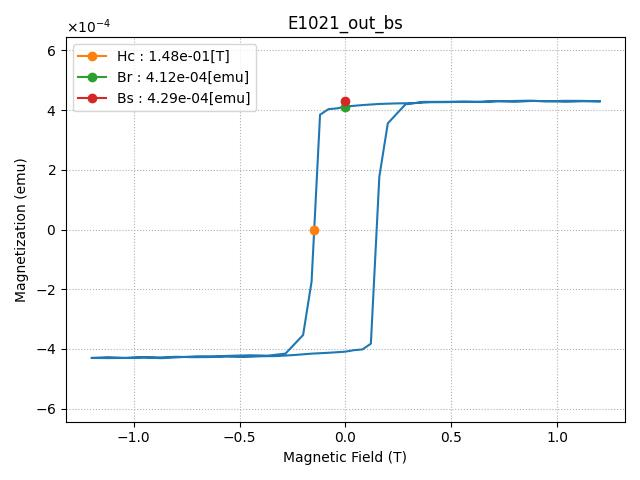
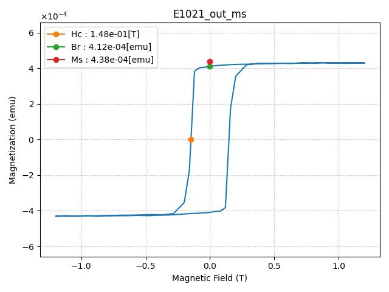
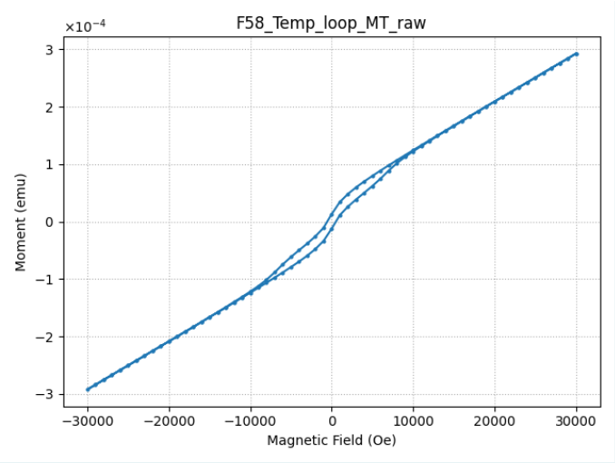

# VSMデータセットテンプレート

## 概要

VSM(磁気特性)をご利用の方に適したテンプレートです。Quantum Design社(MPMS)のdatフォーマット、LakeShore社のTXTフォーマット、玉川製作所(TAMAKAWA)のVSMフォーマットのファイルについて、ヒステリシス曲線を描画し、メタ情報を抽出する。<br>
VSMの専門家によって監修されたメタ情報をデータファイルから自動的にRDEが抽出します。ヒステリシス曲線として、B-H曲線（磁束密度－磁場）およびM-H曲線（飽和磁化－磁場）を出力します。

## カタログ番号

本テンプレートには、装置メーカーの違いによって以下のバリエーションが提供されています。
- DT0015
    - TAMAKAWA
- DT0016
    - LakeShore
- DT0017
    - MPMS

## 登録できるデータ

本データセットテンプレートで作成したデータセットには、'データファイル'と'構造化ファイル'と'メタ情報'を登録することができます。なお、データファイルは１つ登録する必要があります。

### 登録ファイル

以下は本データセットテンプレートに登録可能なファイルの一覧です。

|種類|命名規則|説明|
|:----|:----|:----|
|dat, txt, VSMフォーマット|※以下の'拡張子以外の命名規則について'参照|VSM(もしくは付属ソフトウェア)が出力するデータファイル|

- 登録ファイルの中身 (以下、例)
  - EIKO＠643_O20230125-3_VSM_In20230126.dat (テキストデータ)
    
  - E1021_out.txt (テキストデータ)
    
  - EIKO＠643_DO20230908-1-1_VSM_In20230911.VSM (テキストデータ)
    　
    　
- 拡張子以外の命名規則について (ただし、txtフォーマットは対象外)
  - ベース名は`_`で区切られた2つ以上のセクションで構成され、セクション2は試料名(ローカルID)メタにマッピングされる
  - ベース名の左から3つ目以降の`_`は区切り文字として扱わない
  - ファイル名 (以下、例)
    - EIKO＠643_DO20230506-1_VSM_In20230631.dat
    - EIKO＠643_DO20230908-1-1_VSM_In20230911.VSM

|| 文字列 セクション１| 文字列セクション2| 文字列 セクション2-1| 文字列 セクション2-2| 文字列 セクション2-3| 文字列 セクション2-4| 文字列 セクション2-5| 文字列 セクション3| 文字列 セクション4|
|-------|--------------|-------------------|--------------|-----------------|---------------|--------------|--------------|------------------|----------------|
|例） EIKO＠643_DO20230506-1_VSM_In20230631.dat| EIKO＠643| DO20230506-1| DO| 2023| 05| 06| -1| VSM| In20230531.dat|
|例） EIKO＠643_DO20230908-1-1_VSM_In20230911.VSM| EIKO＠643| DO20230908-1-1| DO| 2023| 09| 08| -1-1| VSM| In20230911.VSM|
|内容| スパッタリング装置| 試料名| 測定者イニシャル| 試料作製年| 試料作製月| 試料作製日| 枝番| invoice/登録データタイプ| ファイル名|
|データ型| 文字列| 文字列| 文字列最大2桁| 19 or 20から始まる4桁| 試料作成年のあとの2桁| 試料作成月のあとの2桁| 試料作成日のあと| VSM| In20230531.dat|
|マッピング| invoice/sputtering_apparatus| invoice/specimen_label| --| invoice/sample_year| invoice/sample_month| --| --| invoice/common_data_type| --|
|必須|〇|〇|〇|〇|〇|〇|--|〇|〇|

### 出力ファイル
- ファイル名の<入力ファイル>は、入力ファイルである`VSMが出力する生データファイル`（EIKO＠643_O20230125-3_VSM_In20230126.datなど）のファイル名です。

|ファイル名|内容|備考|
|:----|:----|:----|
|<入力ファイル>|nonshared_rawデータファイル||
|metadata.json|主要パラメータメタ情報ファイル||
|<入力ファイル>_raw.csv|生データをプロットするための数値ファイル<br>入力ファイルから該当行を抜き出す||
|<入力ファイル>_param.csv|特徴量リストファイル<br>特徴量の取得に失敗した場合は作成しない||
|<入力ファイル>.csv|バックグラウンド処理、特異点除去、特徴量抽出処理を行った数値ファイル||
|<入力ファイル>_bs.png|B-H曲線の画像。設定ファイルで代表画像ファイルに指定可能。||
|<入力ファイル>_ms.png|M-H曲線の画像。設定ファイルで代表画像ファイルに指定可能。||
|<入力ファイル>_raw.png|画像ファイル。<入力ファイル>_raw.csvを可視化。||


### メタ情報

次のように、大きく3つに分類されます。

- 基本情報
- 固有情報
- 抽出メタ情報

#### 基本情報

基本情報はすべてのデータセットテンプレート共通のメタです。詳細は[データセット閲覧 RDE Dataset Viewer > マニュアル](https://dice.nims.go.jp/services/RDE/RDE_manual.pdf)を参照してください。

#### 固有情報

固有情報はデータセットテンプレート特有のメタです。以下は本データセットテンプレートに設定されている固有メタ情報項目です。

- **対応形式列について**  
  空欄の場合は「すべてのフォーマットで共通」して登場します。


|項目名|必須|タクソノミー|日本語名|英語名|type|単位|初期値(.dat)|初期値(.VSM)|初期値(.txt)|対応形式|備考|
|:----|:----|:----|:----|:----|:----|:----|:----|:----|:----|:----|:----|
|sample_size_height|||サンプルサイズ(縦)|Sample size(height)|number|mm||||.VSM, .txt| |
|sample_size_width|||サンプルサイズ(横)|Sample size(width)|number|mm||||.VSM, .txt| |
|sample_size_thickness|||サンプルサイズ(厚さ)|Sample size(thickness)|number|mm||||.VSM, .txt| |
|key1|||キー1|key1|string|||||.txt|汎用項目|
|key1|||キー2|key1|string|||||.txt|汎用項目|
|key3|||キー3|key3|string|||||.txt|汎用項目|
|key4|||キー4|key4|string|||||.txt|汎用項目|
|key5|||キー5|key5|string|||||.txt|汎用項目|
|sample_area|||サンプル膜面積|Sample area|number|cm2||||.VSM| |
|correction_factors|||補正係数|Correction factor|number||1|1||.VSM| |
|background_removal|||バックグラウンド処理の有無|Background removal|boolean||true|false|true| | 
|spike_removal|||スパイクノイズ除去処理の有無|Spike removal|boolean||true|false|true| | 
|feature_acquisition|||特徴量取得の有無|Feature acquisition|boolean||true|true|true| | 
|sputtering_apparatus||1|スパッタリング装置|Sputtering Apparatus|string||EIKO＠643|||.dat, .VSM|<入力ファイル> 文字列セクション1をマッピング|
|specimen_label||4|試料名|Specimen label|string||DO20230506-1|||.dat, .VSM|<入力ファイル> 文字列セクション2をマッピング|
|sample.year||2|試料作製年|Sample year|number||2023|||.dat, .VSM|<入力ファイル> 文字列セクション2-2をマッピング|
|sample.month||3|試料作製月|Sample month|number||05|||.dat, .VSM|<入力ファイル> 文字列セクション2-3をマッピング|
|common_data_type||5|登録データタイプ|Data type|string||VSM|TAMAKAWA-VSM|LakeShore| |デフォルト設定|
|common_data_origin|||データの起源|Data Origin|string||experiment|experiments|experiments| | 
|common_technical_category|||技術カテゴリー|Technical Category|string||measurement|measurement|property| | 
|common_reference|||参考文献|Reference|string||||| | 
|property_property|||特徴的性質|Property|string||磁性|磁性|磁性| | 
|property_sub_category|||サブカテゴリー|Sub category|string||飽和磁化|保持力(coercivity)|保持力(coercivity)| | 
|measurement_method_category|||計測法カテゴリー|Method category|string||磁気特性|磁気特性|磁気特性| | 
|measurement_method_sub-category|||計測法サブカテゴリー|Method sub-category|string||磁気特性測定システム|磁気特性測定システム|磁気特性測定システム| | 
|measurement_analysis_field|||分析分野|Analysis field|string||構造、微細組織、磁気特性||| | 
|measurement_measurement_environment|||測定環境|Measurement environment|string||||| | 
|measurement_energy_level_transition_structure_etc._of_interest|||対象準位_遷移_構造|Energy Level_Transition_Structure etc. of interest|string||||| | 
|measurement_measured_date|||分析年月日|Measured date|string[date]||2023-05-31||| |FILEOPENTIMEからyyyy-mm-ddで取得|
|measurement_standardized_procedure|||標準手順|Standardized procedure|string||||| | 
|measurement_instrumentation_site|||装置設置場所|Instrumentation site|string||千現地区||| | 


#### 抽出メタ

抽出メタ情報は、データファイルから構造化処理で抽出したメタデータです。以下は本データセットテンプレートに設定されている抽出メタ情報項目です。入力フォーマット別に表示します。

---

#### dat形式 抽出メタ  
|パラメータ名|取得元|タクソノミー|RDE2.0 日本語名|RDE2.0 英語名|type|単位|初期値|備考|
|:----|:----|:----|:----|:----|:----|:----|:----|:----|
|appname|APPNAME||APPNAME|APPNAME|string||MPMS3 Measurement Release 1.1.16 Build 424,MultiVu Release 2.3.4.19|
|byapp|BYAPP||BYAPP|BYAPP|string||MPMS3,1.0,1.1|
|coil_serial_number|COIL_SERIAL_NUMBER||コイルシリアル番号|COIL_SERIAL_NUMBER|string||"	TCI385"|
|comment|COMMENT||コメント|COMMENT|string||1|
|fieldgroup_dc|FIELDGROUP_DC||磁場グループ_DC|FIELDGROUP_DC|string||2,3,4,14,34,35,36,37,38,39,40,41,42,43,44,45,46,47|
|fieldgroup_vsm|FIELDGROUP_VSM||磁場グループ_VSM|FIELDGROUP_VSM|string||2,3,4,5,6,8,9,10,11,14,15|
|fileopentime|FILEOPENTIME||ファイルを開いた時間|FILEOPENTIME|string||3894688341.28241,05/31/2023,9:52 am|
|moment_units|MOMENT_UNITS||磁化の単位|MOMENT_UNITS|string||0|
|motor_hw_version|MOTOR_HW_VERSION||モーターハードウエアのバージョン|MOTOR_HW_VERSION|string||3101-100 N4|
|motor_module_name|MOTOR_MODULE_NAME||モーターモジュールの名前|MOTOR_MODULE_NAME|string||Linear Motor Servo Controller|
|motor_serial_number|MOTOR_SERIAL_NUMBER||モーターのシリアル番号|MOTOR_SERIAL_NUMBER|string||MMC1329|
|motor_software_versi|MOTOR_SOFTWARE_VERSION||モーターソフトウエアのバージョン|MOTOR_SOFTWARE_VERSION|string||01.04.28	|
|oven_hw_version|OVEN_HW_VERSION||オーブンハードウエアのバージョン|OVEN_HW_VERSION|string||unknown|
|oven_module_name|OVEN_MODULE_NAME||オーブンモジュールの名前|OVEN_MODULE_NAME|string||Quantum Design VSM Oven Module|
|oven_serial_number|OVEN_SERIAL_NUMBER||オーブンのシリアル番号|OVEN_SERIAL_NUMBER|string||OVB226|
|oven_software_version|OVEN_SOFTWARE_VERSION||オーブンソフトウエアのバージョン|OVEN_SOFTWARE_VERSION|string||unknown|
|sample_comment|SAMPLE_COMMENT||サンプルコメント|SAMPLE_COMMENT|string||14.5701|
|sample_holder|SAMPLE_HOLDER||サンプルホルダー|SAMPLE_HOLDER|string||Straw|
|sample_holder_detail|SAMPLE_HOLDER_DETAIL||サンプルホルダー詳細|SAMPLE_HOLDER_DETAIL|string||Standard|
|sample_mass|SAMPLE_MASS||サンプル重量|SAMPLE_MASS|number|||
|sample_material|SAMPLE_MATERIAL||サンプルの材質|SAMPLE_MATERIAL|string|||
|sample_molecular_weight|SAMPLE_MOLECULAR_WEIGHT||サンプルのモル量|SAMPLE_MOLECULAR_WEIGHT|number|||
|sample_offset|SAMPLE_OFFSET||サンプルオフセット|SAMPLE_OFFSET|number|mm|68.58|
|sample_shape|SAMPLE_SHAPE||サンプル形状|SAMPLE_SHAPE|string||
|sample_size|SAMPLE_SIZE||サンプルサイズ|SAMPLE_SIZE|string||6.02*2.46	|||"[height]*[width] or [height]*[width]*[thicknes]"|
|sample_volume|SAMPLE_VOLUME||サンプル体積|SAMPLE_VOLUME|string||
|squid_hw_version|SQUID_HW_VERSION||SQUIDハードウエアのバージョン|SQUID_HW_VERSION|string||3101-501 B0|
|squid_module_name|SQUID_MODULE_NAME||SQUIDモジュール名|SQUID_MODULE_NAME|string||Quantum Design Squid Module|
|squid_serial_number|SQUID_SERIAL_NUMBER||SQUIDシリアル番号|SQUID_SERIAL_NUMBER|string||SQD043|
|squid_software_version|SQUID_SOFTWARE_VERSION||SQUIDソフトウエアのバージョン|SQUID_SOFTWARE_VERSION|string||01.03.04|
|startupaxis_x|STARTUPAXIS_X||測定開始時のX軸|STARTUPAXIS_X|string||2|
|startupaxis_y1|STARTUPAXIS_Y1||測定開始時のY軸|STARTUPAXIS_Y1|string||5|
|time|TIME||時間|TIME|string||2|
|background_removal|invoice.json||バックグラウンド処理の有無|Background removal|||true|
|spike_removal|invoice.json||スパイクノイズ除去処理の有無|Spike removal|||			true|
|feature_acquisition|invoice.json||特徴量取得の有無|Feature acquisition|||			true|
|height|送り状に値が入っていれば送り状から取得、入っていなければSAMPLE_SIZE[height]より取得||サンプルサイズ(縦)|SAMPLE_SIZE(height)|number|mm|6.02|送り状に値が入っていれば送り状から取得、入っていなければSAMPLE_SIZE[height]より取得|
|width|送り状に値が入っていれば送り状から取得、入っていなければSAMPLE_SIZE[width]より取得||サンプルサイズ(横)|SAMPLE_SIZE(width)|number|mm|2.46|送り状に値が入っていれば送り状から取得、入っていなければSAMPLE_SIZE[width]より取得|
|thickness|送り状に値が入っていれば送り状から取得、入っていなければSAMPLE_SIZE[thickness]より取得||サンプルサイズ(厚さ)|SAMPLE_SIZE(thickness)|number|nm|1|送り状に値が入っていれば送り状から取得、入っていなければSAMPLE_SIZE[thickness]より取得|
|hc|||保磁力|Hc|string|T|2.12e-02|解析処理により取得、絶対値とする|
|br|||残留磁化|Br|string|emu|1.18e-05|解析処理により取得|
|bs|||磁束密度|Bs|string|emu|8.46e-05|解析処理により取得|
|bs_per_volume_corrected|||磁束密度/体積|Bs/Volume|number|emu/cm^3|5712.6651|計算式：Bs/(SAMPLE_SIZE(height))*SAMPLE_SIZE(widht*SAMPLE_SIZE(thickness))*1E+09<br>条件：SAMPLE_SIZEに値が入っていない場合：値を出力しないで正常終了とする。|
|brt|||残留磁化|Br|string|emu|1.18e-05|解析処理により取得|


---

#### txt形式 抽出メタ  
| パラメータ名   | 取得元 | タクソノミー | RDE2.0 日本語名 | RDE2.0 英語名 | type   | 単位     | 初期値    | 備考                                   |
|--------------|--------|------------|----------------|--------------|--------|---------|---------|------------------------------------|
| hc      |        |            | 保磁力         | Hc           | string | T       | 2.12e-02 | 解析処理により取得、絶対値にする         |
| br   |        |            | 残留磁化       | Br           | string | emu     | 1.18e-05 | 解析処理により取得                     |
| bs    |        |            | 磁束密度       | Bs           | string | emu     | 8.46e-05 | 解析処理により取得                     |
| bs_per_volume|        |            | 磁束密度/体積  | Bs/Volume    | number | emu/cm³ |         | =Hc/(縦*横*厚さ) 計算式：Bs/(SAMPLE_SIZE(height)*SAMPLE_SIZE(width)*SAMPLE_SIZE(thickness))*1E+09 |  

 ---

#### VSM形式 抽出メタ  
| パラメータ名 | 取得元| タクソノミー| RDE2.0 日本語名| RDE2.0 英語名 | type | 単位| 初期値| 備考 |
|-----------------------------|-------------------------|-----------------------|-----------------------|------------------------|--------------------------|------|---------------------------------------------------------|-----------------------------------------------------|
|date| date || 測定日 | date| string| | 2023/09/11||
|sample_name| sample name|| サンプル名 | sample name | string| | DO20230908-1-1||
|applied_magnetic_field| meas. seq. filename|| 印加磁場条件 | Applied magnetic field| string| | MaxField=21000Oe:Speed1=50Oe/Sec:Speed2=50Oe/Sec<250Oe:Fix0degree:Lock-in-Amp_range_fix=False:Sweep_Over_OK=False:Transient_record=False||
|temperature| temperature(max) || 温度 | temperature | number| C | -300 ||
|max_magnetic_field| max magnetic field || 最大磁化 | max magnetic field| number| Oe| 21000||
|calibration_value| calibration value|| キャリブレーション値 | calibration value | number| | 0.01864||
|sample_thickness| sample thickness|| サンプル厚さ | sample thickness| number| nm| 0 ||
|sample_cross_section| Sample Area || サンプル断面積 | sample cross section| number| cm2 | 0 ||
|correction_of_demagnetization_field| correction(demagnetization field)|| 反磁界補正の有無 | correction of demagnetization field| string | | NO||
|correction_of_diamagnetism| correction(diamagnetism) || 反磁性補正 | correction of diamagnetism| string| | YES ||
|add-subtract_process| correction(subtraction)|| 加減算処理 | add-subtract process| string| | NO||
|segment_processing| correction(addition) || セグメント処理 | segment processing| string| | NO||
|spline_interpolation| correction(spline) || スプライン補間 | spline interpolation| string| | NO||
|smoothing_process| correction(smoothing)|| 平滑化処理 | smoothing process | string| | NO||
|correction_of_image_effect| correction(image effect) || ミラー補正 | crrection of image effect| string| | YES ||
|hc||| 保磁力 | Hc| string| T | 2.12e-02||
|br||| 残留磁化 | Br| string| emu | 1.18e-05||
|br_per_volume||| 残留磁化/体積| Br/Volume | string| T || 残留磁化/(サンプルサイズ(厚さ)*1.0E-07*サンプル膜面積)*4π/10000、送り状に値が設定されている場合は送り状を優先|
|br_per_volume_corrected| || 残留磁化/体積（補正後） | Br/Volume(Corrected)| string| T | |残留磁化/(サンプルサイズ(厚さ)*1.0E-07*サンプル膜面積)*4π/10000*補正係数 |
|ms||| 飽和磁化 | Ms| string| emu | 8.46e-05|x軸の最大値と最小値の絶対値の平均とする。|
|ms_per_volume||| 飽和磁化/体積| Ms/Volume | number| T | |飽和磁化/(サンプルサイズ(厚さ)*1.0E-07*サンプル膜面積)*4π/10000、送り状に値が設定されている場合は送り状を優先|
|ms_per_volume_corrected| || 飽和磁化/体積（補正後） | Ms/Volume(Corrected)| number| T | |飽和磁化/(サンプルサイズ(厚さ)*1.0E-07*サンプル膜面積)*4π/10000*補正係数 |
 

## データカタログ項目


データカタログの項目です。データカタログはデータセット管理者がデータセットの内容を第三者に説明するためのスペースです。

|RDE2.0用パラメータ名|日本語語彙|英語語彙|データ型|備考|
|:----|:----|:----|:----|:----|
|catalog|データカタログ|Data Catalog|object||
|dataset_title|データセット名|Dataset Title|string||
|abstract|概要|Abstract|string||
|data_creator|作成者|Data Creator|string||
|language|言語|Language|string||
|experimental_apparatus|使用装置|Experimental Apparatus|string||
|data_distribution|データの再配布|Data Distribution|string||
|raw_data_type|データの種類|Raw Data Type|string||
|stored_data|格納データ|Stored Data|string||
|remarks|備考|Remarks|string||
|references|参考論文|References|string||
|key1|キー1|key1|string|汎用項目
|key2|キー2|key2|string|汎用項目
|key3|キー3|key3|string|汎用項目
|key4|キー4|key4|string|汎用項目
|key5|キー5|key5|string|汎用項目

## 構造化処理の詳細

### 設定ファイルの説明

構造化処理を行う際の、設定ファイル(`rdeconfig.yaml`)の項目についての説明です。

| 階層 | 項目名 | 語彙 | データ型 | 標準設定値 | 備考 |
|:----|:----|:----|:----|:----|:----|
| system | extended_mode | 動作モード | string | (なし) | データファイル一括投入時'MultiDataTile'を設定 |
| system | magic_variable | マジックネーム | string | 'true' | ファイル名 = データ名としない場合は'false'に設定 |
| system | save_thumbnail_image | サムネイル画像保存  | string | 'true' | |
| vsm | manufacturer | 装置メーカー名 | string | 'mpms' or 'LakeShore' or 'TAMAKAWA' | |
| vsm | main_image_setting | 代表画像の設定 | string | bs | メイングラフ画像をB-H曲線に設定する場合'bs',M-H曲線に設定する場合'ms'を設定 |
| vsm | plot_bs_curve | B-H曲線描画設定  | string | 'true' | 'false'の場合B-H曲線を描画しない|
| vsm | plot_ms_curve | M-H曲線描画設定  | string | 'true' | 'false'の場合M-H曲線を描画しない|


### dataset関数の説明

VSMが出力するデータを使用した構造化処理を行います。以下関数内で行っている処理の説明です。

```python
def dataset(
    srcpaths: RdeInputDirPaths,
    resource_paths: RdeOutputResourcePath,
) -> None:
    """Execute structured processing in VSM.

    Execute structured text processing, metadata extraction, and visualization.
    It handles structured text processing, metadata extraction, and graphing.
    Other processing required for structuring may be implemented as needed.

    Args:
        srcpaths: Paths to input resources for processing.
        resource_paths: Paths to output resources for saving results.

    Returns:
        None

    Note:
        The actual function names and processing details may vary depending on the project.

    """
```
### 構造化ファイルのパスを作成
- 元ファイル名を元に、関連する複数のCSVファイルのパスを自動生成している処理です。
```python
    # 拡張子・ファイル名ベース
    raw_file = resource_paths.rawfiles[0]
    raw_basename = raw_file.stem

    # 共通CSVパス
    csv_path_graph = resource_paths.struct.joinpath(f"{raw_basename}.csv")
    csv_path_param = resource_paths.struct.joinpath(f"{raw_basename}_param.csv")
    csv_path_raw = resource_paths.struct.joinpath(f"{raw_basename}_raw.csv")
```

### 設定ファイル、使用クラスの取得

- 設定ファイルの設定項目については、[こちら](#設定ファイルの説明) を参照
```python
    # Get the class to use
    config = VsmFactory.get_config(resource_paths.rawfiles[0], srcpaths.tasksupport)
    module = VsmFactory.get_objects(resource_paths.rawfiles[0], srcpaths.tasksupport, config)
```

#### ファイルの読み込み
- メタデータ、計測データ、ファイル名トークンを取得
- 入力データから『磁場』,『磁気モーメント』,『直流磁気モーメント』に該当する列名をそれぞれ特定して取得する
- read_invoiceで、画面の入力項目を読み込む
```python
    # 入力データ読み込み
    meta = df_data = fname_token = None
    is_filename_mapping_rule = False
    moment_flag = None

    if srcpaths.tasksupport.joinpath("filename_mapping_rule.txt").exists():
        is_filename_mapping_rule = True

    meta, df_data, fname_token = module.file_reader.read(resource_paths, is_filename_mapping_rule)
    x_col, rm_col, dc_rm_col = module.file_reader.identify_columns(df_data)
    invoice_obj = module.file_reader.read_invoice(resource_paths.invoice_org)
```

#### CSVファイルへの保存
- 計測データを、特徴量リストファイル(csv_path_param) 、 生データをプロットするための数値ファイル(csv_path_raw) 、生データに各種修正を加えた数値ファイル(csv_path_graph)に保存する

```python
        # Save csv
        # Modified processing due to modularization
    fit_data, characteristic_values, moment_flag = module.structured_processer.to_csv_3types(
        df_data,
        csv_path_param,
        csv_path_raw,
        csv_path_graph,
        x_col=x_col,
        rm_col=rm_col,
        dc_rm_col=dc_rm_col,
        header=meta,
        invoice_obj=invoice_obj,
    )
```

#### メタデータの解析と保存
- resource_paths.meta のディレクトリのパスにmetadata.jsonを保存する

```python
    # メタデータ保存
    const_meta_info, repeated_meta_info = module.meta_parser.parse(meta, characteristic_values, invoice_obj)
    module.meta_parser.save_meta(
        resource_paths.meta.joinpath("metadata.json"),
        Meta(srcpaths.tasksupport.joinpath("metadata-def.json")),
        const_meta_info=const_meta_info,
        repeated_meta_info=repeated_meta_info,
    )
```

#### 送り状の更新
- ファイル名やメタデータを元に、送り状の該当項目(データ名、パッタリング装置、試料名、試料作製年月、分析年月日)を上書きする。

```python
    # インボイス保存
    module.file_reader.overwrite_invoice(
        invoice_obj,
        meta,
        is_filename_mapping_rule,
        fname_token,
        resource_paths.invoice.joinpath("invoice.json"),
    )
```
#### 計測データの可視化
- プロットを生成するためのメソッドを呼び出す
- 生成されたグラフを 代表画像ファイル(resource_paths.main_image) 、画像ファイル (resource_paths.other_image)  に保存する

```python
        # Graph
    module.graph_plotter.plot_corrected_original(
        df_data,
        fit_data,
        characteristic_values,
        raw_basename,
        invoice_obj,
        resource_paths.main_image,
        resource_paths.other_image,
        moment_flag,
        x_col=x_col,
        rm_col=rm_col,
        dc_rm_col=dc_rm_col,
    )
```